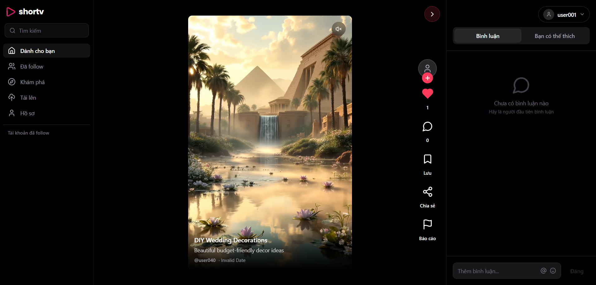
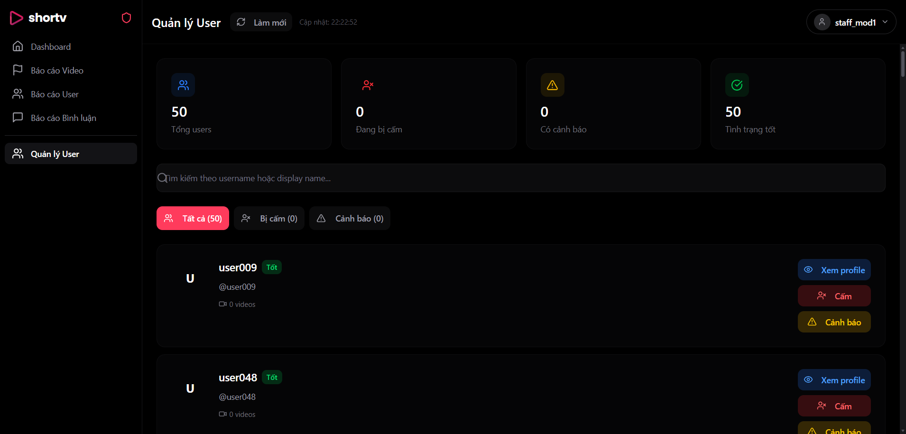

<p align="center">
  <h1 align="center">🎬 ClipIQ Platform</h1>
  <p align="center">
    <strong>An intelligent video-sharing platform with AI-powered search</strong>
  </p>
  <p align="center">
    <a href="#features">Features</a> •
    <a href="#tech-stack">Tech Stack</a> •
    <a href="#installation">Installation</a> •
    <a href="#api-documentation">API</a> •
    <a href="#contributing">Contributing</a>
  </p>
</p>

<p align="center">
  
  
  
  
  
</p>

---

## 📖 Overview

**ClipIQ** is a full-featured video-sharing platform built with a modern architecture and enhanced with AI for intelligent search.

### ✨ Highlights

- 🎥 **Upload & Stream Videos** — Upload videos with automatic thumbnail processing
- 🔍 **AI-powered Search** — Powered by Mistral AI + Qdrant Vector Database + Elasticsearch
- 🏠 **Personalized Feed** — Recommend videos based on user interests
- 👤 **Account System** — Sign up, sign in, and profile management
- 🛡️ **Role-based Access Control** — Admin, Staff, User with different permissions
- 📊 **Admin Dashboard** — Statistics and content/user management

---

## 🚀 Features

### 👥 User
| Feature | Description |
|--------|-------------|
| 🔐 Register/Login | JWT authentication with access token & refresh token |
| 📤 Upload videos | Upload videos with title, description, tags |
| 🎬 Watch videos | Stream videos with an integrated player |
| ❤️ Like/Unlike | Interact with videos |
| 💬 Comments | Comment and reply to comments |
| 🔔 Subscribe | Subscribe/Unsubscribe channels |
| 🔗 Share videos | Generate shareable video links |
| 🔍 Search | Search videos by text or OCR |
| 👤 Profile | Manage profile details and avatar |

### 👮 Staff
| Feature | Description |
|--------|-------------|
| 📋 View reports | View violation reports |
| ⚠️ Warn users | Send warnings to users |
| 🚫 Ban users | Ban policy-violating users |
| 🗑️ Remove content | Remove violating videos/comments |

### 👑 Admin
| Feature | Description |
|--------|-------------|
| 📊 Dashboard | System overview stats |
| 👥 User management | View, edit, ban/unban users |
| 👮 Staff management | Promote/demote staff members |
| ⚙️ System settings | Configure upload limits, maintenance mode |
| 📈 Analytics | View detailed analytics |

---

## UI Showcase

### User Interface
<p align="center">
  
  <br>
  <em>Personalized Home Feed</em>
</p>

<p align="center">
  
  <br>
  <em>User Profile & Video Management</em>
</p>

### Staff & Admin Interface
<p align="center">
  
  <br>
  <em>Staff Dashboard for Content Moderation</em>
</p>

---

## 🛠️ Tech Stack

### Backend
| Technology | Purpose |
|-----------|---------|
| **Node.js 20+** | Runtime environment |
| **Express.js** | Web framework |
| **PostgreSQL 14+** | Relational database |
| **MinIO** | Object storage (S3-compatible) |
| **Qdrant** | Vector database for semantic search |
| **Elasticsearch** | Full-text search & OCR text search |
| **Mistral AI** | AI classification for search queries |
| **JWT** | Authentication with access/refresh tokens |
| **Bcrypt** | Password hashing |

### Frontend
| Technology | Purpose |
|-----------|---------|
| **React 18+** | UI library |
| **Vite** | Build tool & dev server |
| **TypeScript** | Type-safe JavaScript |
| **Tailwind CSS** | Utility-first CSS |
| **Radix UI** | Accessible component primitives |
| **Redux Toolkit** | State management |
| **Axios** | HTTP client |
| **React Hook Form** | Form handling |
| **Recharts** | Charts & analytics |

### Infrastructure
| Technology | Purpose |
|-----------|---------|
| **Docker** | Containerization |
| **Docker Compose** | Multi-container orchestration |
| **Nginx** | Reverse proxy (production) |

---

## 📁 Project Structure

```bash
clipiq-platform/
├── backend/
│   ├── src/
│   │   ├── config/         # Database, MinIO configuration
│   │   ├── controllers/    # Request handlers
│   │   ├── database/       # Migrations & seeders
│   │   ├── middlewares/    # Auth, validation, error handling
│   │   ├── models/         # Data models (PostgreSQL)
│   │   ├── routes/         # API route definitions
│   │   ├── services/       # Business logic
│   │   ├── utils/          # Helper functions
│   │   ├── validators/     # Request validation schemas
│   │   └── server.js       # Express server entry point
│   ├── docs/               # API & Architecture documentation
│   └── package.json
│
├── frontend/
│   ├── src/
│   │   ├── api/            # API client functions
│   │   ├── components/     # React components
│   │   │   ├── admin/      # Admin dashboard components
│   │   │   ├── staff/      # Staff panel components
│   │   │   ├── user/       # User-facing components
│   │   │   └── ui/         # Reusable UI components (shadcn)
│   │   ├── store/          # Redux store & slices
│   │   ├── hooks/          # Custom React hooks
│   │   └── App.tsx         # Main application component
│   └── package.json
│
├── docker-compose.yml      # Docker services configuration
├── .env.example            # Environment variables template
└── README.md
