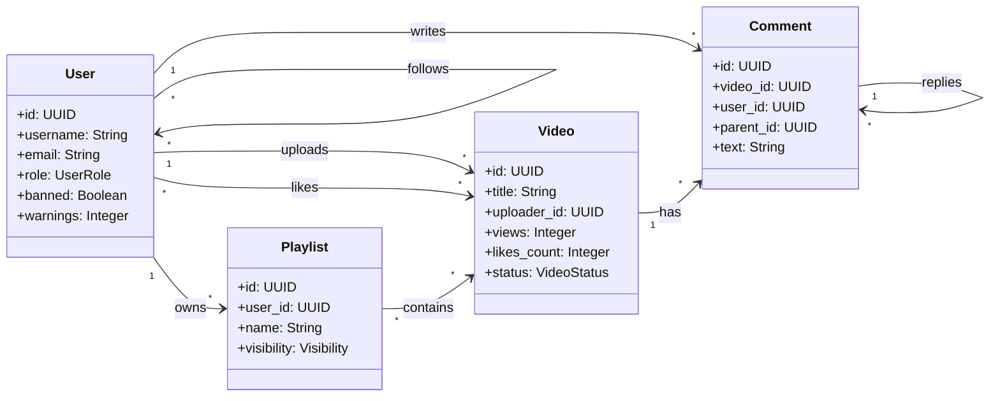
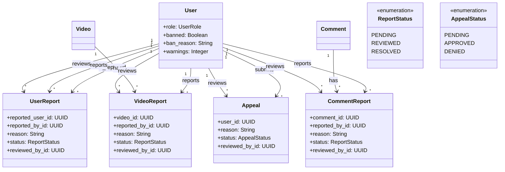
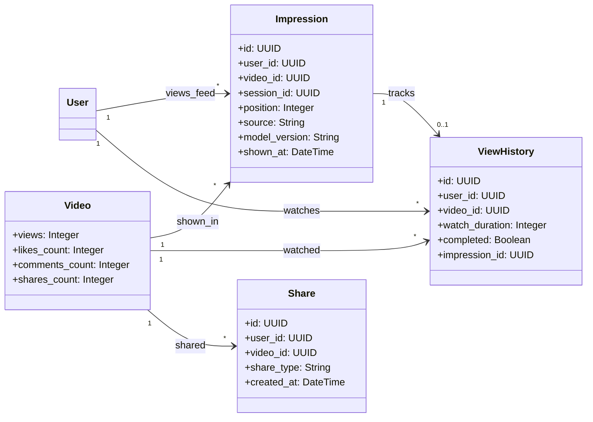

# ClipIQ Class Diagram (UML)

> **Last Updated:** 2025-12-30  
> **Notation:** Mermaid UML Class Diagram

## Full Class Diagram

```mermaid
classDiagram
    direction TB

    %% ============================================
    %% Core Classes
    %% ============================================
    
    class User {
        +UUID id
        +String username
        +String email
        +UserRole role
        +String password
        +Boolean banned
        +DateTime ban_expiry
        +String ban_reason
        +Integer warnings
        +Boolean is_demoted
        +String display_name
        +String bio
        +String avatar_url
        +DateTime created_at
        +DateTime updated_at
    }

    class Video {
        +UUID id
        +String title
        +String description
        +UUID uploader_id
        +String thumbnail_url
        +String video_url
        +Integer duration
        +Integer views
        +Integer likes_count
        +Integer comments_count
        +Integer shares_count
        +VideoStatus status
        +ProcessingStatus processing_status
        +DateTime upload_date
        +DateTime created_at
        +DateTime updated_at
    }

    class Comment {
        +UUID id
        +UUID video_id
        +UUID user_id
        +UUID parent_id
        +String text
        +Boolean edited
        +DateTime created_at
        +DateTime updated_at
    }

    class Like {
        +UUID id
        +UUID user_id
        +UUID video_id
        +DateTime created_at
    }

    %% ============================================
    %% Enumerations
    %% ============================================

    class UserRole {
        <<enumeration>>
        ADMIN
        STAFF
        USER
    }

    class VideoStatus {
        <<enumeration>>
        ACTIVE
        DELETED
        FLAGGED
    }

    class ProcessingStatus {
        <<enumeration>>
        PROCESSING
        READY
        FAILED
    }

    class ReportStatus {
        <<enumeration>>
        PENDING
        REVIEWED
        RESOLVED
    }

    class AppealStatus {
        <<enumeration>>
        PENDING
        APPROVED
        DENIED
    }

    class PlaylistVisibility {
        <<enumeration>>
        PUBLIC
        UNLISTED
        PRIVATE
    }

    %% ============================================
    %% Report Classes
    %% ============================================

    class UserReport {
        +UUID id
        +UUID reported_user_id
        +UUID reported_by_id
        +String reason
        +String evidence_url
        +ReportStatus status
        +UUID reviewed_by_id
        +DateTime reviewed_at
        +String resolution_note
        +DateTime created_at
    }

    class VideoReport {
        +UUID id
        +UUID video_id
        +UUID reported_by_id
        +String reason
        +String evidence_url
        +ReportStatus status
        +UUID reviewed_by_id
        +DateTime reviewed_at
        +String resolution_note
        +DateTime created_at
    }

    class CommentReport {
        +UUID id
        +UUID comment_id
        +UUID reported_by_id
        +String reason
        +String evidence_url
        +ReportStatus status
        +UUID reviewed_by_id
        +DateTime reviewed_at
        +String resolution_note
        +DateTime created_at
    }

    class Appeal {
        +UUID id
        +UUID user_id
        +String reason
        +AppealStatus status
        +UUID reviewed_by_id
        +DateTime reviewed_at
        +String resolution_note
        +DateTime created_at
    }

    %% ============================================
    %% Social Feature Classes
    %% ============================================

    class Subscription {
        +UUID id
        +UUID follower_id
        +UUID following_id
        +DateTime created_at
    }

    class Notification {
        +UUID id
        +NotificationType type
        +UUID receiver_id
        +UUID actor_id
        +UUID video_id
        +UUID comment_id
        +String message
        +Boolean read
        +DateTime created_at
    }

    class NotificationType {
        <<enumeration>>
        NEW_VIDEO
        NEW_COMMENT
        NEW_LIKE
        NEW_SUBSCRIBER
        VIDEO_FLAGGED
        BAN_WARNING
        BAN_APPEAL_RESOLVED
    }

    class Share {
        +UUID id
        +UUID user_id
        +UUID video_id
        +String share_type
        +DateTime created_at
    }

    %% ============================================
    %% Playlist Classes
    %% ============================================

    class Playlist {
        +UUID id
        +UUID user_id
        +String name
        +String description
        +PlaylistVisibility visibility
        +DateTime created_at
        +DateTime updated_at
    }

    class PlaylistVideo {
        +UUID id
        +UUID playlist_id
        +UUID video_id
        +Integer position
        +DateTime added_at
    }

    %% ============================================
    %% Analytics Classes
    %% ============================================

    class ViewHistory {
        +UUID id
        +UUID user_id
        +UUID video_id
        +Integer watch_duration
        +Boolean completed
        +UUID impression_id
        +DateTime created_at
    }

    class Impression {
        +UUID id
        +UUID user_id
        +UUID video_id
        +UUID session_id
        +Integer position
        +String source
        +String model_version
        +DateTime shown_at
    }

    %% ============================================
    %% System Classes
    %% ============================================

    class SystemSetting {
        +String key
        +String value
        +String description
        +DateTime updated_at
    }

    class SystemLog {
        +UUID id
        +String action_type
        +UUID performed_by_id
        +UUID target_user_id
        +UUID target_video_id
        +String details
        +JSON metadata
        +DateTime created_at
    }

    %% ============================================
    %% Relationships
    %% ============================================

    %% User relationships
    User "1" --> "*" Video : uploads
    User "1" --> "*" Comment : writes
    User "1" --> "*" Like : gives
    User "1" --> "*" Playlist : creates
    User "1" --> "*" Share : shares
    User "1" --> "*" ViewHistory : watches
    User "1" --> "*" Impression : views
    User "1" --> "*" Notification : receives
    User "1" --> "*" Appeal : submits

    %% Video relationships
    Video "1" --> "*" Comment : has
    Video "1" --> "*" Like : receives
    Video "1" --> "*" Share : shared
    Video "1" --> "*" ViewHistory : watched
    Video "1" --> "*" Impression : shown
    Video "1" --> "*" VideoReport : reported

    %% Comment relationships
    Comment "1" --> "*" Comment : replies
    Comment "1" --> "*" CommentReport : reported

    %% Subscription (self-referencing)
    User "*" --> "*" User : follows

    %% Report relationships
    User "1" --> "*" UserReport : reported
    User "1" --> "*" UserReport : reports

    %% Playlist relationships
    Playlist "1" --> "*" PlaylistVideo : contains
    Video "1" --> "*" PlaylistVideo : in_playlist

    %% System relationships
    User "1" --> "*" SystemLog : performs

    %% Impression -> ViewHistory
    Impression "1" --> "0..1" ViewHistory : tracked_by
```

## Simplified Core Diagram

## Moderation System Diagram

## Analytics System Diagram

---

## Notes

- All primary keys use **UUID** type with `gen_random_uuid()` default
- All tables have **created_at** timestamp
- Core tables (users, videos, comments, playlists) have **updated_at** with auto-update trigger
- Foreign keys use **CASCADE** delete for owned entities
- Foreign keys use **SET NULL** for reviewer/actor references
- Denormalized counts on videos table for performance
